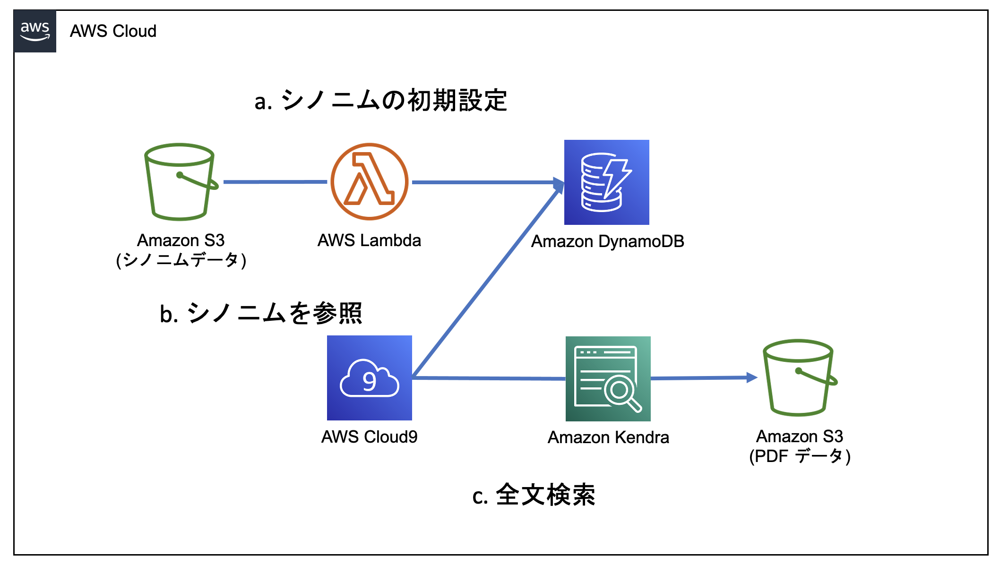
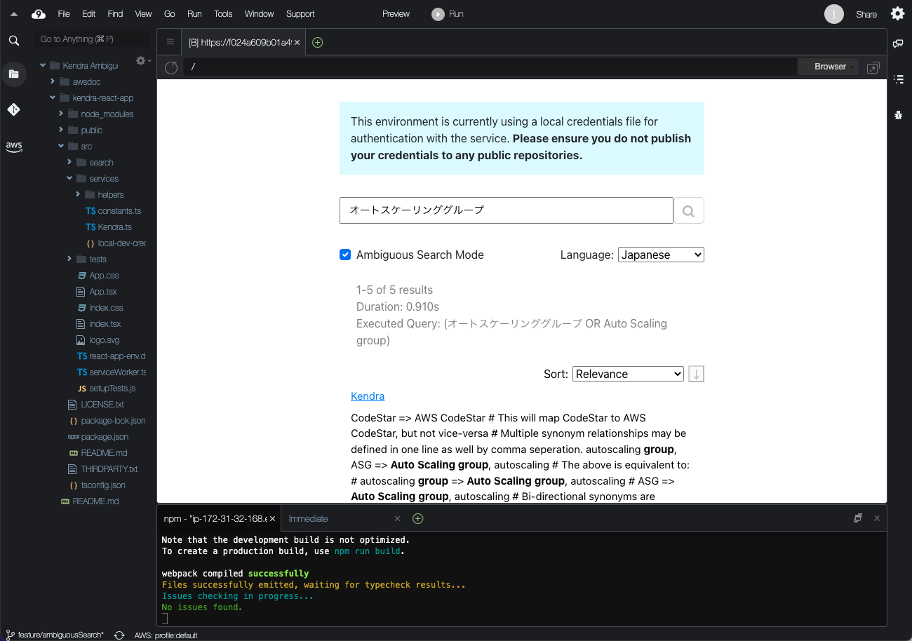

# Getting Started / スタートガイド

このページではサンプルアプリの立ち上げ方について説明します。

2022/10/12 現在 Kendra は 東京リージョン (ap-northeast-1) で利用できません。
このサンプルアプリはバージニア北部 (us-east-1) で動作確認済みです。

## Architecture / 構成図


## Preview / 動作イメージ


## Prerequisites / 事前準備
- AWS アカウント
- AdministratorAccess 権限を持った IAM ユーザ

## Setup
### Step1:　Kendra の Indexつくる
- [Kendra のコンソール](https://us-east-1.console.aws.amazon.com/kendra/home)にアクセスし、Indexを作成します。

設定値は以下のとおりです。その他はデフォルト値です。

| TITLE | VALUE |
| --- | --- |
| Index name | aws-doc-ambiguous |
| IAM role | Create a new role |
| Role name | AmazonKendra-us-east-1-ambiguous |

Indexの作成には30分程度がかかります。作成の完了を待たずに次のステップに進みます

### Step2: S3 バケットをつくる
- [S3 のコンソール](https://s3.console.aws.amazon.com/s3/get-started?region=us-east-1)にアクセスし、S3 バケットを作成します。

設定値は以下のとおりです。その他はデフォルト値です。

| TITLE | VALUE |
| --- | --- |
| バケット名 | kendra-<名前>-<年月日> |

### Step3: Cloud9 環境をつくる
- [Cluod9 のコンソール](https://us-east-1.console.aws.amazon.com/cloud9/home/product)にアクセスし、環境を作成します。

設定値は以下のとおりです。その他はデフォルト値です。

| TITLE | VALUE |
| --- | --- |
| Name | Kendra Ambiguous |
| Instance type | t3.small (2 GiB RAM + 2 vCPU) |

環境の作成には数分かかります。作成の完了を待たずに次のステップに進みます。

### Step4: Dynamodb のテーブルをつくる
- [DynamoDB のコンソール](https://us-east-1.console.aws.amazon.com/dynamodbv2/home?region=us-east-1#service)にアクセスし、テーブルを作成します。

設定値は以下のとおりです。その他はデフォルト値です。

| TITLE | VALUE |
| --- | --- |
| テーブル名 | kendra-synonym |
| パーティションキー | keyword |

テーブルの作成には数分かかります。作成の完了を待たずに次のステップに進みます。

### Step5: S3 に検索対象のデータを入れる
- [Cloud9 のコンソール](https://us-east-1.console.aws.amazon.com/cloud9/home?region=us-east-1)に戻り、`Kendra Ambiguous` の項目の Open IDE ボタンから環境を開きます。
- 右下のターミナルに以下コマンドを入力します。

バケット名は世界で一意な値になります。`バケット名`を Step2 で設定した値で置き換えて下さい。

```bash
# 送信先の S3バケットを設定
BUCKET_NAME=バケット名

# AWSの公式ドキュメントをローカルにダウンロード
mkdir awsdoc
pushd awsdoc
wget https://docs.aws.amazon.com/ja_jp/AWSEC2/latest/UserGuide/ec2-ug.pdf -O EC2.pdf
wget https://docs.aws.amazon.com/ja_jp/AmazonS3/latest/userguide/s3-userguide.pdf -O S3.pdf
wget https://docs.aws.amazon.com/ja_jp/AmazonRDS/latest/UserGuide/rds-ug.pdf -O RDS.pdf
wget https://docs.aws.amazon.com/ja_jp/AmazonRDS/latest/AuroraUserGuide/aurora-ug.pdf -O Aurora.pdf
wget https://docs.aws.amazon.com/ja_jp/amazondynamodb/latest/developerguide/dynamodb-dg.pdf -O DynamoDB.pdf
wget https://docs.aws.amazon.com/ja_jp/lambda/latest/dg/lambda-dg.pdf -O Lambda.pdf
wget https://docs.aws.amazon.com/ja_jp/vpc/latest/userguide/vpc-ug.pdf -O VPC.pdf
wget https://docs.aws.amazon.com/ja_jp/kendra/latest/dg/kendra-dg.pdf -O Kendra.pdf
wget https://docs.aws.amazon.com/ja_jp/Route53/latest/DeveloperGuide/route53-dg.pdf -O Route53.pdf
popd

# S3バケットにアップロード
aws s3 cp awsdoc s3://${BUCKET_NAME}/awsdoc/ --recursive
```

### Step6: Kendra の data sourceつくる
- [Kendra のコンソール](https://us-east-1.console.aws.amazon.com/kendra/home?region=us-east-1#indexes)に戻り、`aws-doc-ambiguous` を選択します
- 左側のペインから Data source をクリックし Amazon S3 の Add connector をクリックします。

設定値は以下のとおりです。その他はデフォルト値です。

バケット名は世界で一意な値になります。`バケット名`を Step2 で設定した値で置き換えて下さい。

| TITLE | VALUE |
| --- | --- |
| Data source name | aws-doc-jp |
| Default language | Japanese (ja) |
| Enter the data source location | s3://バケット名 |
| Include patterns (Additional configuration) | Prefix: awsdoc |
| IAM role | Create a new role | 
| Role name | AmazonKendra-ambiguous |
| Frequency | Run on demand |

Include patterns の追加には Add ボタンのクリックが必須であることに注意して下さい

- Sync now ボタンをクリック

Sync には時間がかかります。作成の完了を待たずに次のステップに進みます。

### Step7: Lambda を作る
- [Lambda のコンソール](https://us-east-1.console.aws.amazon.com/lambda/home?region=us-east-1#/functions)にアクセスし、`関数の作成`をクリックします。
- `設計図の使用`をクリックし`ブループリントをフィルタリング`に`s3`と入力します。
- Python3.7 の`Get S3 object` を選択後、`設定`ボタンをクリックします。
次の値で設定します。その他はデフォルト値です。

| TITLE | VALUE |
| --- | --- |
| 関数名 | kendra_synonym_parser |
| ロール名 | kendra_synonym_parser |
| Bucket | s3/バケット名 |
| Event type | PUT |
| Prefix | thesaurus/ |
| Recursive invocation | チェックを入れる |

- 次の手順で IAM role に DynamoDB のアクセス権を与えて下さい。
- `kendra_synonym_parser` の設定ページから`設定タブ`をクリックし`アクセス権限`の実行ロールから`kendra_synonym_parser` をクリックします。
- 次の手順で ポリシーを追加します。
- 遷移先の IAM コンソール画面で `許可を追加`から`ポリシーをアタッチ`をクリックします。

さらに`ポリシーを作成`ボタンをクリックし、`JSON`タブに下記内容をペーストします。

```
{
    "Version": "2012-10-17",
    "Statement": [
        {
            "Sid": "VisualEditor0",
            "Effect": "Allow",
            "Action": "dynamodb:Scan",
            "Resource": "*"
        },
        {
            "Sid": "VisualEditor1",
            "Effect": "Allow",
            "Action": [
                "dynamodb:BatchWriteItem",
                "dynamodb:PutItem",
                "dynamodb:DeleteItem",
                "dynamodb:Scan"
            ],
            "Resource": "*"
        }
    ]
}
```

- 名前に `allow_access_to_dynamodb` と入力し、ポリシーを作成します。
- ポリシーの作成ができたら、`kendra_synonym_parser`ロールのタブに戻り、リロードボタンをクリック後、`allow_access_to_dynamodb` ポリシーをアタッチします。
- `kendra_synonym_parser` Lambda関数のコードタブに次のコードを貼り付けます。

また、貼り付ける際は 10 行目の `バケット名`を任意の名前に書き換えて下さい

```
import urllib.parse
from typing import List, Dict
import collections
import boto3


TABLE_NAME, DDB_PRIMARY_KEY, DDB_ATTRIBUTES_NAME = "kendra-synonym", "keyword", "synonym"
DDB_TABLE = boto3.resource('dynamodb').Table(TABLE_NAME)
S3 = boto3.client('s3')
BUCKET_NAME = "バケット名"
S3_KEY_NAME = "thesaurus/synonym"


def download_synonym_file() -> List[str]:
    """
    S3 からのファイルダウンロード
    """
    return S3.get_object(Bucket=BUCKET_NAME, Key=S3_KEY_NAME)['Body'].read().decode('utf-8').split('\n')


def read_synonym_file() -> List[str]:
    """
    シソーラスファイルを読み込み
    """
    FILE_PATH = "synonym"
    with open(FILE_PATH) as f:
        l = f.readlines()
    return l


def cleansing(synonyms: List[str]) -> List[str]:
    """
    シソーラスファイルからコメント行を排除
    """
    clean_synonym = []
    for s in synonyms:
        if s.strip() and s.strip()[0] != '#':
            clean_synonym.append(s.strip())
    return clean_synonym


def insert_synonyms(synonyms: List[Dict[str, List[str]]]):
    """
    DynamoDB にシノニムを追加
    """
    try:
        with DDB_TABLE.batch_writer() as batch:
            for s in synonyms:
                for k, v in s.items():
                    batch.put_item(
                        Item={
                            DDB_PRIMARY_KEY: k,
                            DDB_ATTRIBUTES_NAME: v
                        }
                    )
    except Exception as error:
        raise error


def delete_synonyms():
    """
    DynamoDBの中身を全消去
    """
    delete_items = []
    parameters = {}

    # DynamoDBをscan
    while True:
        response = DDB_TABLE.scan(**parameters)
        delete_items.extend(response["Items"])
        if ("LastEvaluatedKey" in response):
            parameters["ExclusiveStartKey"] = response["LastEvaluatedKey"]
        else:
            break

    # データ削除
    delete_keys = [{k: v for k, v in x.items() if k in DDB_PRIMARY_KEY}
                   for x in delete_items]
    with DDB_TABLE.batch_writer() as batch:
        for key in delete_keys:
            batch.delete_item(Key=key)


def lambda_handler(event, context):
    print("==== start ====")
    # csv fileを取得
    BUCKET_NAME = event['Records'][0]['s3']['bucket']['name']
    S3_KEY_NAME = urllib.parse.unquote_plus(
        event['Records'][0]['s3']['object']['key'], encoding='utf-8')
    synonym_list = []
    tokens = []

    # 不要な行を削除
    for s in cleansing(download_synonym_file()):
        # 単方向シノニムか双方向シノニムかの判定
        if '=>' in s:  # 双方向シノニムの場合
            if len(s.split('=>')) == 2:
                # 左側のトークンと右側の用語に分割
                token_str, word_str = s.split('=>')
                token_list = set([ts.strip() for ts in token_str.split(',')])
                word_list = set([ws.strip() for ws in word_str.split(',')])

                for tl in token_list:
                    synonym_list.append({tl: [wl for wl in word_list]})
                    tokens.append(tl)
            else:
                raise ValueError("Invalid Input: 矢印の個数が合いません")
        else:  # 単方向シノニムの場合
            # カンマで分割
            token_list = set([ts.strip() for ts in s.split(',')])

            for tl_i, tl in enumerate(token_list):
                synonym_list.append(
                    {tl: [wl for wl_i, wl in enumerate(token_list) if tl_i != wl_i]})
                tokens.append(tl)

    # トークンが重複している場合、エラー
    if len([k for k, v in collections.Counter(tokens).items() if v > 1]) > 0:
        raise ValueError("Invalid Input: 重複するトークンがあります")

    # DynamoDBの中身を全消去
    delete_synonyms()

    # DynamoDBへの書き込み
    insert_synonyms(synonym_list)

    print("==== success ====")
```

- 貼り付けられたら、 `Deploy` ボタンをクリックします。

### Step8: Web アプリ用の IAM　ユーザーを作る
- [IAM Policy のコンソール](https://us-east-1.console.aws.amazon.com/iamv2/home?region=us-east-1#/policies$customer)にアクセスし、次の内容を json タブに貼り付ける

バケット名は世界で一意な値になります。`バケット名`を Step2 で設定した値で置き換えて下さい。

```
{
    "Version": "2012-10-17",
    "Statement": [
        {
            "Sid": "VisualEditor0",
            "Effect": "Allow",
            "Action": [
                "kendra:SubmitFeedback",
                "kendra:GetQuerySuggestions",
                "kendra:Query",
                "kendra:DescribeIndex",
                "dynamodb:Query",
                "kendra:ListFaqs",
                "kendra:DescribeDataSource",
                "kendra:ListDataSources",
                "kendra:DescribeFaq",
                "kendra:DescribeQuerySuggestionsConfig"
            ],
            "Resource": "*"
        },
        {
            "Sid": "VisualEditor1",
            "Effect": "Allow",
            "Action": "s3:GetObject",
            "Resource": "arn:aws:s3:::バケット名/*"
        }
    ]
}
```

- [IAM User のページ](https://us-east-1.console.aws.amazon.com/iamv2/home#/users)で新しいユーザーを追加する。

次の内容で設定します。その他の値はデフォルト値です。

| TITLE | VALUE |
| --- | --- |
| ユーザー名 | kendra-search-user|
| AWS アクセスの種類を選択 | アクセスキー |
| 既存のポリシーを直接アタッチ | synonym-kendra-search-role |

### Step9: 検索アプリケーションを起動する
TODO: git clone のurl書き換え
```
git clone ***
```
- `Cluod9` のターミナルで次のコマンドを入力し、プログラムファイルをダウンロードします。
- `/kendra-react-app/src/services/local-dev-credentials-template.json` ファイルの内容を書き換えます。
- ファイル名を `local-dev-credentials-template.json` から `local-dev-credentials.json` に変更します
- 次のコマンドで起動します

```
cd kendra-react-app/
npm install && npm start
```

- 検索バーに `auto scaling group` と入力し Language を `Japanese`にした上で検索ボタンをクリックします

いくつかのドキュメントが引っかかるはずです

- 検索バーに`オートスケーリンググループ`と入力し Language を `Japanese`にした上で検索ボタンをクリックします

ドキュメントが引っかかりません

ではシノニムを設定します

### Step10: シノニム設定する
- 作成したバケットの S3 のコンソール画面から　`フォルダの作成`ボタンをクリックし、`thesaurus`フォルダを作成します。

`thesaurus` フォルダの中に次の内容を書いたテキストファイルをアップロードします

```txt
# シノニムのサンプルテキストです
# シャープから始まる行はコメントとして無視されます
# 単方向シノニムは左側のトークンと右側の用語を=>の記号で区切ります
# トークンまたは用語として複数の値を設定できます。
# ただしこのサンプルアプリは形態素解析をしていないため、トークンとしてスペースを含めることはできません
オートスケーリンググループ, ASG => Auto Scaling group, autoscaling

# 双方向シノニムは用語をカンマで区切ったリストとして指定します。
# ただしこのサンプルアプリは形態素解析をしていないため、スペースを含んだ値を設定できません
DNS, Route53, ルート53
```

### Step11: 再度検索
- `Ambiguous Search Mode` オプションのチェックを入れます

- 検索バーに`オートスケーリンググループ`と入力し Language を `Japanese`にした上で検索ボタンをクリックします

ドキュメントが引っかかっていることがわかります。シノニム検索が実現できました。

### Step12: Clean up
削除する前に、[Kendra のコンソール](https://us-east-1.console.aws.amazon.com/kendra/home)　で `aws-doc-ambiguous`の Index IDを控えておきます

削除すべき項目は次のとおりです。

- [Cluod9 のコンソール](https://us-east-1.console.aws.amazon.com/cloud9/home/product) で `Kendra Ambiguous` という環境を削除します。
- [Kendra のコンソール](https://us-east-1.console.aws.amazon.com/kendra/home)　で `aws-doc-ambiguous` というIndex を削除します
- [DynamoDB のコンソール](https://us-east-1.console.aws.amazon.com/dynamodbv2/home?region=us-east-1#service)で `kendra-synonym` というTable を削除
- [IAM User のコンソール](https://us-east-1.console.aws.amazon.com/iamv2/home?region=us-east-1#/users)で `kendra-search-user` を削除
- [S3 のコンソール](https://s3.console.aws.amazon.com/s3/buckets?region=us-east-1)で `kendra-<名前>-<年月日>` バケットを削除
- [Lambda のコンソール](https://us-east-1.console.aws.amazon.com/lambda/home?region=us-east-1#/functions) で `kendra_synonym_parser` 関数を削除
- [Cloudwatch Logsのコンソール](https://us-east-1.console.aws.amazon.com/cloudwatch/home?region=us-east-1#logsV2:log-groups)で`/aws/lambda/kendra_synonym_parser` と `/aws/kendra/<KendraのIndex ID>` という2つのロググループを削除します
- [IAM Role のコンソール](https://us-east-1.console.aws.amazon.com/iamv2/home?region=us-east-1#/roles)で `	AmazonKendra-ambiguous`, `AmazonKendra-us-east-1-ambiguous`, `kendra_synonym_parser`, `AWSServiceRoleForAWSCloud9` を削除
- [IAM Policy のコンソール](https://us-east-1.console.aws.amazon.com/iamv2/home?region=us-east-1#/policies)で `allow_access_to_dynamodb`, `AmazonKendra-ambiguous`, `AmazonKendra-us-east-1-ambiguous`, `synonym-kendra-search-role`, `AWSLambdaBasicExecutionRole-` から始まるロール, `AWSLambdaS3ExecutionRole-` から始まるロールを削除