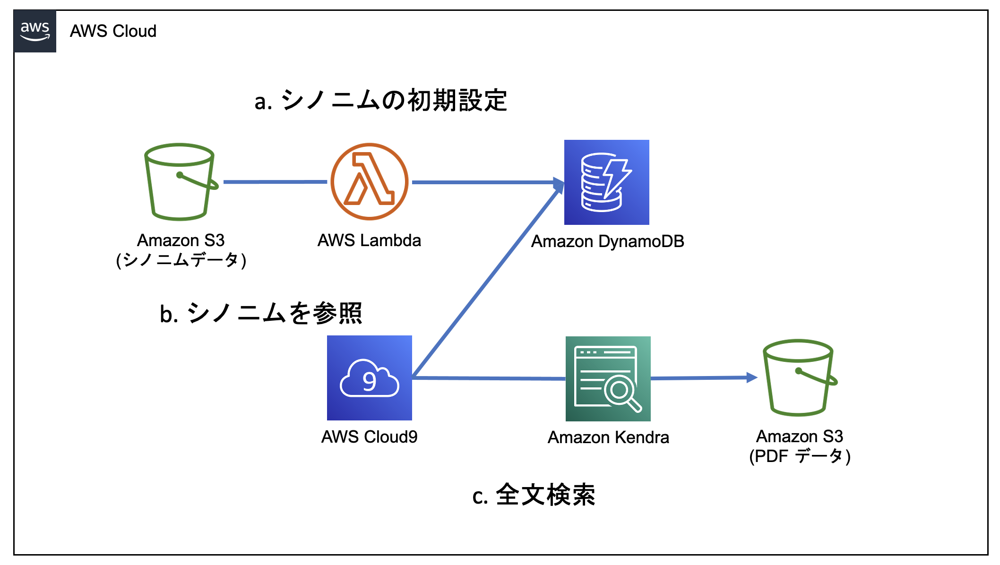
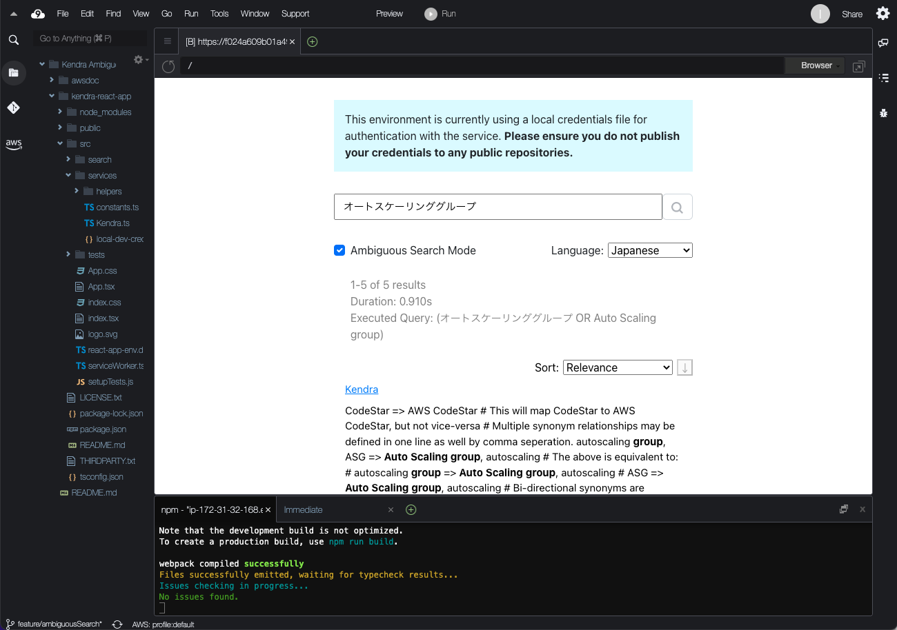

# Kendra Ambiguous Search App

Kendra Ambiguous Search App は Amazon Kendra であいまい検索を実現するためのサンプルアプリです。2022/10/19 Kendra では日本語カスタムシノニムが使えません。そこでこのサンプルでは 他のAWS サービスと連携して擬似的にあいまい検索を実現します。

## Architecture / 構成図

## Preview / 動作イメージ

## Getting Started
このアプリの立ち上げ方は [GETTING_STARTED.ja.md](GETTING_STARTED.ja.md) を御覧ください。

## License Summary

このサンプルコードは、修正されたMITライセンスの下で利用可能になっています。LICENSEファイルを参照してください。
`exampleData1.ts` および `exampleData2.ts` で提供されるサンプルデータは、Amazon Kendra のクエリ API からのモックレスポンスを表しています。 このモックレスポンスは、https://en.wikipedia.org/ からのデータをマッシュアップし、Amazon Kendra からの API レスポンスのように見えるようにフォーマットしたものです。 2つのファイルで提供されるサンプルデータは、Creative Commons Attribution-ShareAlike License (https://en.wikipedia.org/wiki/Wikipedia:Text_of_Creative_Commons_Attribution-ShareAlike_3.0_Unported_License) の下、以下の場所から取得したものです。

    * https://en.wikipedia.org/wiki/Portal:Ancient_Rome 
    * https://en.wikipedia.org/wiki/Battle_of_Mount_Algidus 
    * https://en.wikipedia.org/wiki/Battle_of_Arausio 
    * https://en.wikipedia.org/wiki/Cilician_pirates#Rise_of_piracy 
    * https://en.wikipedia.org/wiki/Culture_of_ancient_Rome 

また、依存する外部ライブラリのライセンスについては `THIRDPARTY.txt` を御覧ください

## セキュリティに関するお問い合わせ
[CONTRIBUTING](CONTRIBUTING) をご参照下さい。
